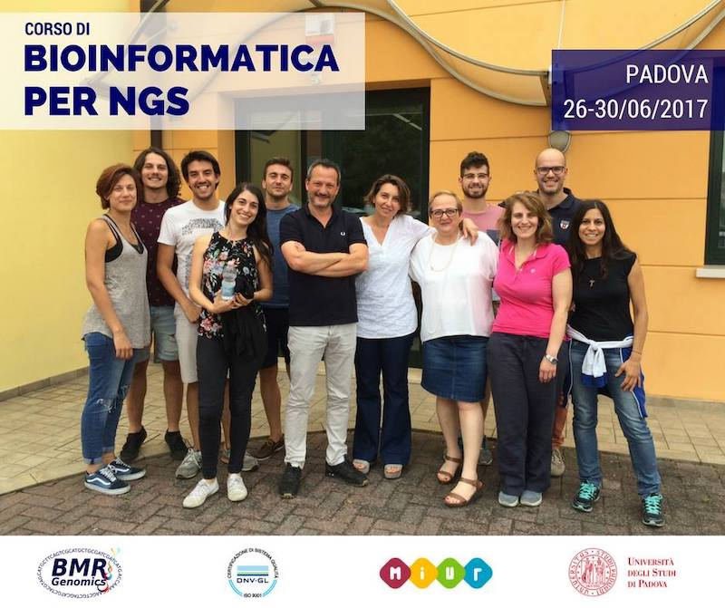

## Bioinformatics training

### Motivation

I wrote my first bioinformatics programs in 2004, for my batchelor project, and at that time I realized the 
potential of bionformatics training for biologists.
Since then I constantly devoted a relevant fraction of my work to prepare and deliver training, often with
amazing colleagues. 
Organizing short courses and practicals for undergraduate students allowed me to understand the different needs
of students having varying levels of confidence with computers, and to come up with a teaching method that rely
on using the computer as a dry lab where to test hypotheses and to inspect specimens.

### Experience

On-contract professor at the University of Padua:
  * Genomics (2009, 2010, 2012, [2014](http://perl.4ngs.com/))
  * Bioinformatics I (2008, 2011, 2012, 2013)
  * Molecular Biology I (2008, 2011)
  * Bioinformatics for Genomics ([University of Ferrara](http://m.docente.unife.it/docenti-en/andrea.telatin), 2015)

Trainer at [BMR Genomics](https://www.bmr-genomics.it/servizi/area-formazione/bioinformatica-16s-ngs/) (spin-off)
  * 40 hours bioinformatics training for researchers (held twice a year, 2015-2017)
  * 8 hours bioinformatics training "_Bioinformatics approaches to adaptations, genome evolution and biological associations_" (2015)

Trainer at the [Quadram Institute Bioscience](https://www.quadram.ac.uk/):
  * [Bash for Bioinformatics](https://github.com/telatin/learn_bash/wiki) (2018-2020)
  * Guest trainer at the [CLIMB Workshop in the Gambia, 2018](https://www.climb.ac.uk/mrc-climb-bioinformatics-workshop-at-the-mrc-unit-in-the-gambia/)
  * Invited Trainer at the [Young Biologists Symposium, Lebanon](https://eventscal.lau.edu.lb/conferences/ybs2018/program.php)
  * Bite-sized bioinformatics ([2019-2020](https://medium.com/@telatin))

